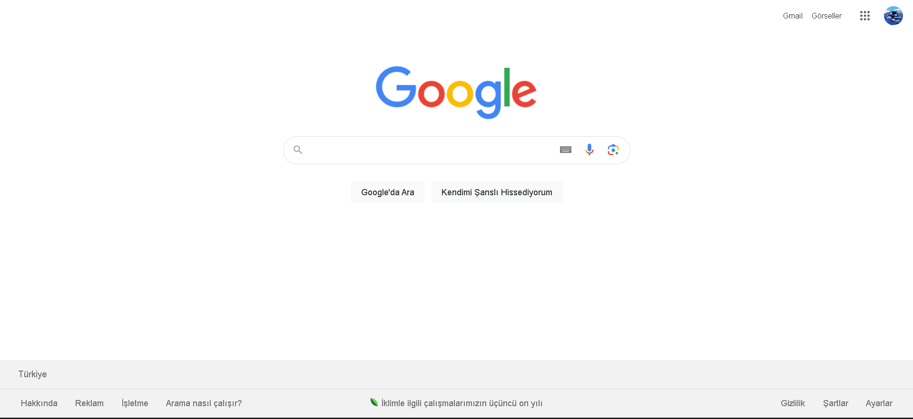
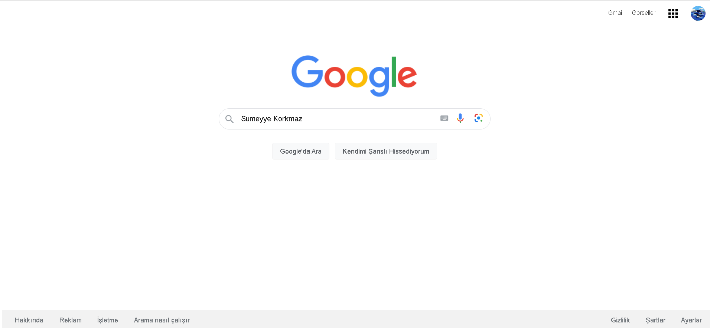

# Eski Google Ana Sayfasını Tasarlamak
Google 1996 yılında kuruldu ve ilk versiyonunu 1998 yılında yayınladı. 1998, çok uzun bir süre önce değil mi? İlk versiyonu ile şu anki versiyonu arasında büyük fark var tabii ki. Peki size Google'ın ilk versiyonunu gösterebileceğimizi söylesek ne hissederdiniz?  
İnternetteki gelmiş geçmiş bütün web sitelerini görebileceğiniz Wayback Machine adında bir web arşivi bulunmakta.[Google 1998](https://web.archive.org/web/19981202230410if_/http://www.google.com/) linkinden Google'ın ilk versiyonu nasılmış görebilirsiniz.
Bende kendi yaptığım tasarımı aşağıda yayınladım.Bu projemde table,input ve button taglerini kullandım.  
  
Kullandığım [logoyu](https://web.archive.org/web/19990504112211im_/http://www.google.com/google.jpg) buradan bulabilirsiniz.

# Güncel Google Ana Sayfasını Tasarlamak
2023 tarihli güncel google search sayfasını tasarladım.Aşağıya ilk olarak google gerçek sayfasının resmi koydum.
  
Bu koyduğum sayfa ise benim tasarımım olan :  
  

